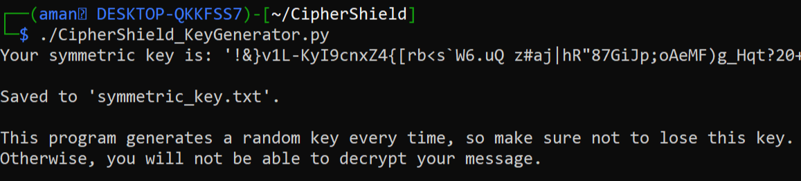
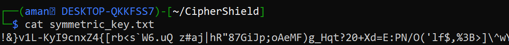
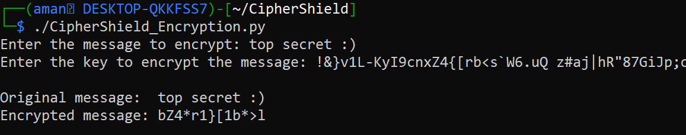
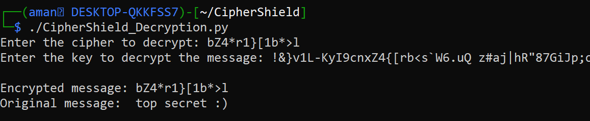

# CipherShield

CipherShield is a Python-based project consisting of programs for symmetric key encryption and decryption.

## Programs Overview

* **Key Generation Program**
  - Generates a symmetric key each time it runs.
  - Saves the generated key into a file named `symmetric_key.txt`.

* **Encryption Program**
  - Takes a plaintext message and a symmetric key as inputs.
  - Encrypts the message using the provided key.
  - Outputs the encrypted ciphertext.

* **Decryption Program**
  - Takes an encrypted ciphertext and the corresponding symmetric key as inputs.
  - Decrypts the ciphertext back to its original plaintext form.

## Usage

1. **Key Generation Program**
   - Execute `CipherShield_KeyGenerator.py`.
   
   

   - The generated symmetric key will be saved in `symmetric_key.txt`.
       
   

2. **Encryption Program**
   - Run `CipherShield_Encryption.py`.
   - Enter the plaintext message and provide the symmetric key when prompted.
   - The encrypted ciphertext will be displayed.

   

3. **Decryption Program**
   - Execute `CipherShield_Decryption.py`.
   - Input the encrypted ciphertext and the corresponding symmetric key.
   - The decrypted plaintext message will be shown.

   

## Setup

1. **Requirements**
   - Python 3.x

2. **Installation**
   - Clone the repository:
     ```
     git clone https://github.com/amanchauhan47/CipherShield.git
     ```

3. **Running the Programs**
   - Navigate to the project directory:
     ```
     cd ciphershield
     ```
   - Make the programs executable (if needed):
     ```
     chmod +x CipherShield_KeyGenerator.py CipherShield_Encryption.py CipherShield_Decryption.py
     ```
   - Follow the usage instructions for each program as described above.

## Future Enhancements
- Implement error handling and validation for key input.
- Add support for different encryption algorithms.
- Improve user interface and add graphical components.

## Contributing
Contributions are welcome! If you'd like to improve this project, please fork the repository and submit a pull request.

## Authors
- Aman Chauhan

## License
This project is licensed under the MIT License - see the LICENSE file for details.
